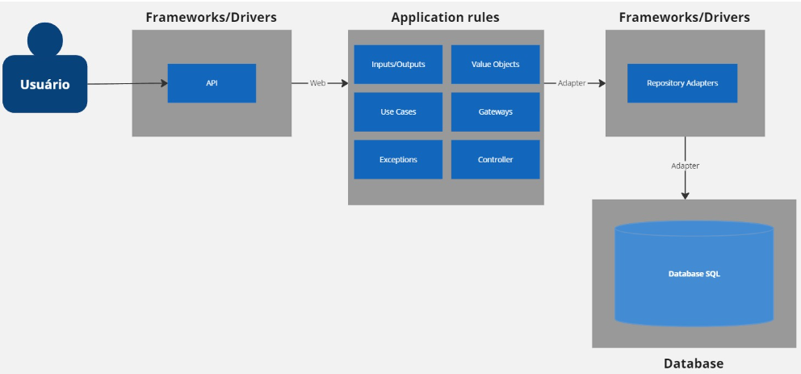

# 🚀 Pagamentos

O sistema em questão é composto por um monolito. A arquitetura segue o padrão de design baseado em um monolito, onde é possível ter como benefícios uma melhor organização do código fonte e menor complexidade de criação para um projeto pequeno. Além disso, implementamos o conceito de Clean Architecture em todo o projeto.

## Estrutura

### Core

#### Controllers

- **AuthenticationController**: Utilizado para realizar a autenticação de login e registrar.
- **CartaoController**: Utilizado para gerar um cartão.
- **ClienteController**: Utilizado para registrar um novo cliente.
- **PagamentoController**: Utilizado para aprovar pagamentos.

#### Exception
- Classes em que foram criadas as exceções para cada caso necessário.

#### Input
- Classes em que são definidos todos os dados de entrada necessários para autenticação, autorização de pagamento, cartões e clientes. Camada que transforma os dados vindos de camadas externas em dados conhecidos para o use case.

#### Output
- Classes em que são definidos todos os dados de saída necessários para comunicação entre core e aplicação. Esta camada contém o resultado final que o use case deve realizar.

#### Services
- Responsável por fazer o gerenciamento dos tokens.

#### Usecases
- Todos os casos de uso necessários dentro do contexto de autenticação, cartão, cliente e pagamento. Esta camada manipula os dados recebidos nos inputs e orquestra as entidades, gateways e outras regras que podem ser aplicadas e por fim retorna um output com dados pertinentes às camadas superiores.

#### VO
- Classes que possuem o objeto de valor do negócio. São definidos os atributos que serão transportados dentro do usecase.

### Infra

- Contém classes que implementam os repositórios cadastrados no pacote “spring”, bem como sobrescrevem seus métodos.

### Spring

#### Controllers
- Contém os controladores REST responsáveis por receber e responder às requisições HTTP relacionadas ao projeto.

#### Entities
- Define as entidades de domínio que representam as classes de autenticação, autorizações, cartões e clientes, bem como suas propriedades.

#### Repositories
- Contém as interfaces que estendem os repositórios do Spring Data JPA para interagir com o banco de dados.

#### Security
- Contém toda a implementação relacionada ao quesito de segurança.

#### Services
- Contém a implementação de buscar um usuário quando feito o login.

#### Swagger
- Contém toda a implementação da documentação swagger, bem como as regras de Http Status Code.

### Diagrama da Arquitetura



## 🛠️ Tecnologias

Java 17

Spring Boot 3.2.8


Spring Data JPA


Spring Doc OpenAPI


H2


Docker


## ⌨️ Acesso Swagger
```http
  GET /swagger-ui/index.html
```

## ✒️ Autores

- [Denis Benjamim](https://www.github.com/denisbenjamim)
- [Matheus Lot Rizzo](https://www.github.com/MatheusLotRizzo)
- [Weslei Trindade](https://www.github.com/westrindade)
- [Nicole Bidigaray](https://www.github.com/Nicole-Bidigaray)
- [Lukas Barcellos](https://www.github.com/Lukas-Barcellos)
